<div align="center">

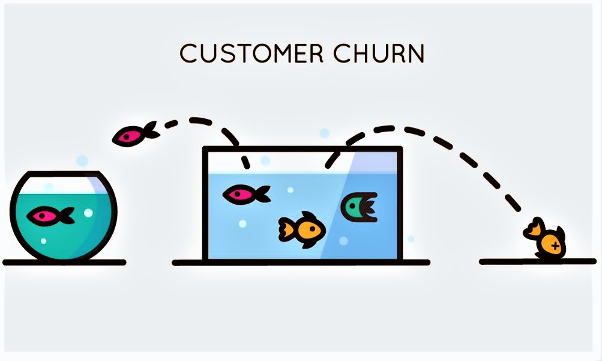

<br/><br/>

# 🛒 Retail Customer Churn Prediction Platform

### End-to-End Machine Learning & MLOps System for Proactive Customer Retention

[](https://python.org)
[](https://fastapi.tiangolo.com)
[](https://streamlit.io)
[](https://mlflow.org)
[](https://docker.com)
[](https://dvc.org)
[](https://github.com/features/actions)
[](#testing)

<br/>

> **Helping retail businesses move from reactive churn analysis to proactive customer retention —
> powered by production-grade ML infrastructure.**

<br/>

[📖 Overview](#-overview) · [🏗️ Architecture](#️-architecture) · [📊 Model Performance](#-model-performance) · [🖥️ Screenshots](#️-screenshots) · [🚀 Quick Start](#-quick-start) · [🗂️ Project Structure](#️-project-structure)

</div>

---

## 📌 Overview

Customer churn costs retail businesses in lost revenue, increased acquisition spend, and reduced lifetime value. This platform predicts **which customers are about to leave** — before they do — and recommends the right retention action for each one.

This project is a fully productionized ML system covering the entire lifecycle: from raw data and model training to a live REST API, an interactive business dashboard, and automated monitoring.

### 🎯 Key Business Questions Answered

| Question | How It's Addressed |
|---|---|
| Which customers are about to churn? | Churn probability scored for every customer |
| What's driving the risk? | SHAP global & local explainability |
| Who should we prioritize? | 4-tier risk segmentation with recommended actions |
| Is the model still reliable? | Evidently AI drift monitoring |
| How do we integrate this into our systems? | Production-ready FastAPI with batch endpoint |

---

## 🏗️ Architecture

```text
┌─────────────────────────────────────────────────────────────────┐
│                        DATA LAYER                               │
│  Raw Customer Data → Validation (Great Expectations) → Features │
└────────────────────────────┬────────────────────────────────────┘
                             │
┌────────────────────────────▼────────────────────────────────────┐
│                       TRAINING LAYER                            │
│  Baseline Models → MLflow Tracking → Hyperparameter Tuning      │
│  (Logistic Regression, Random Forest, XGBoost, LightGBM)       │
└────────────────────────────┬────────────────────────────────────┘
                             │
┌────────────────────────────▼────────────────────────────────────┐
│                     EVALUATION & EXPLAINABILITY                 │
│  Final Model Evaluation → SHAP Analysis → Model Registry        │
└────────────────┬──────────────────────────┬─────────────────────┘
                 │                          │
┌────────────────▼──────────┐  ┌────────────▼─────────────────────┐
│     SERVING LAYER         │  │       MONITORING LAYER           │
│  FastAPI REST API         │  │  Evidently AI Drift Detection    │
│  /predict  /batch-predict │  │  Reference vs. Current Data      │
└────────────────┬──────────┘  └──────────────────────────────────┘
                 │
┌────────────────▼──────────────────────────────────────────────┐
│                   BUSINESS LAYER                              │
│  Streamlit Dashboard: Segmentation · Predictions · Insights   │
└───────────────────────────────────────────────────────────────┘
```

**Pipeline orchestrated with DVC · Experiments tracked in MLflow · CI via GitHub Actions · Containerized with Docker**

---

## 📊 Model Performance

The champion model (Tuned LightGBM) was selected based on **churn-specific business metrics** — because missing a churner (false negative) is far more costly than a false positive.

| Metric | Score |
|---|---|
| **ROC-AUC** | **0.9901** |
| **PR-AUC** | **0.9889** |
| Accuracy | 0.9448 |
| Precision (Churn) | 0.9395 |
| Recall (Churn) | 0.9412 |
| F1-Score (Churn) | 0.9403 |

> ⚡ The model captures **94.1% of actual churners** while maintaining 93.9% precision — making it highly actionable for targeted retention campaigns.

<details>
<summary>📈 View Model Evaluation Charts</summary>

| Confusion Matrix | ROC Curve |
|:---:|:---:|
| 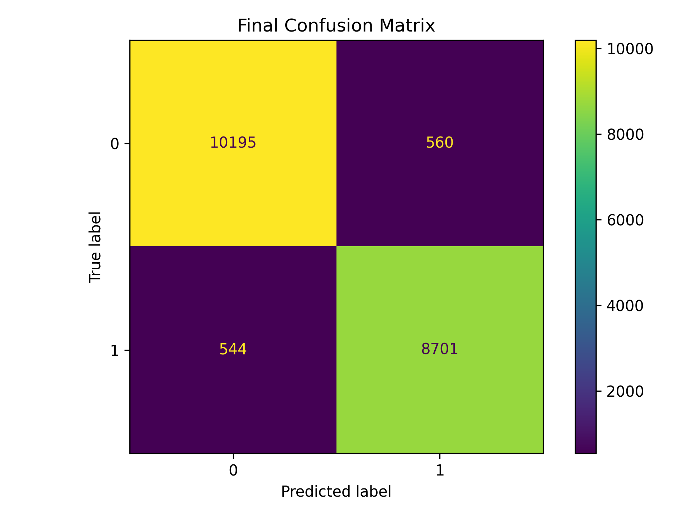 | 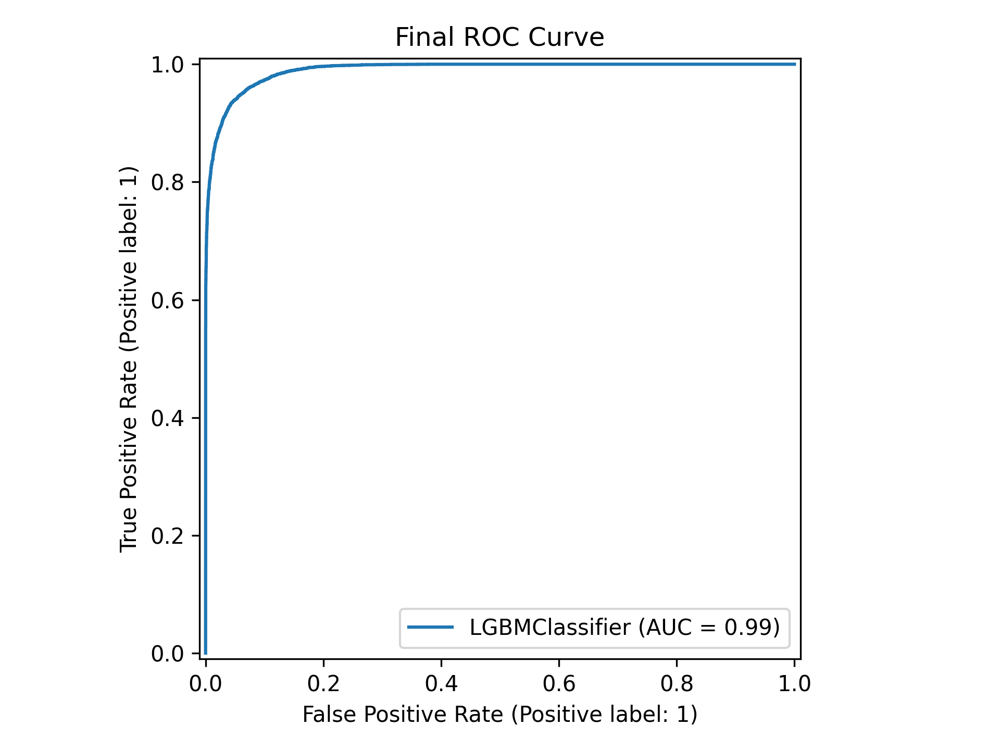 |

| Precision-Recall Curve | Feature Importance |
|:---:|:---:|
| 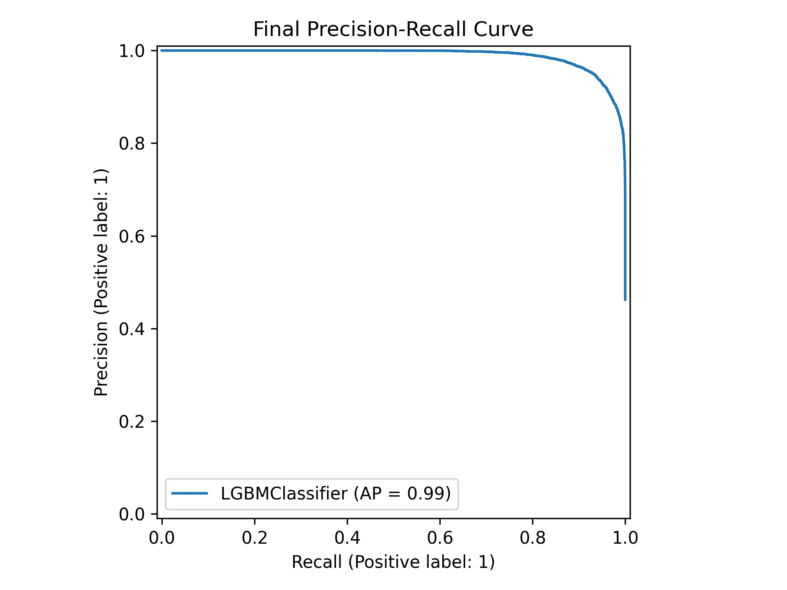 | 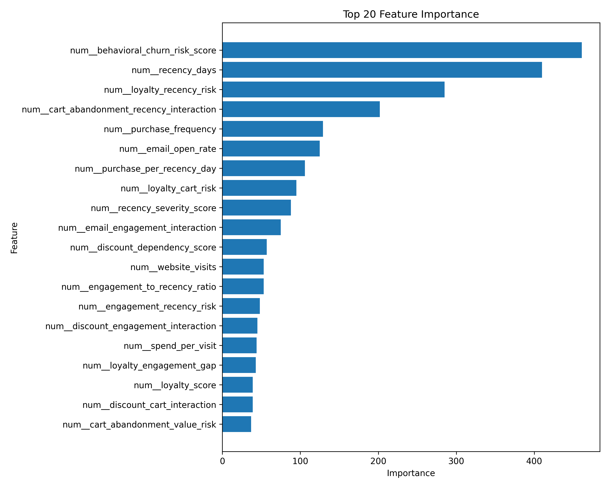 |

</details>

<details>
<summary>🔍 View SHAP Explainability Plots</summary>

| Global Feature Importance | Summary Plot |
|:---:|:---:|
| 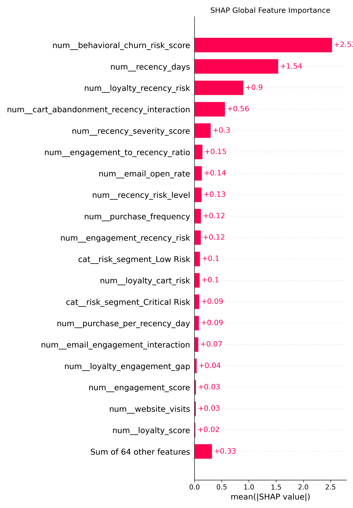 | 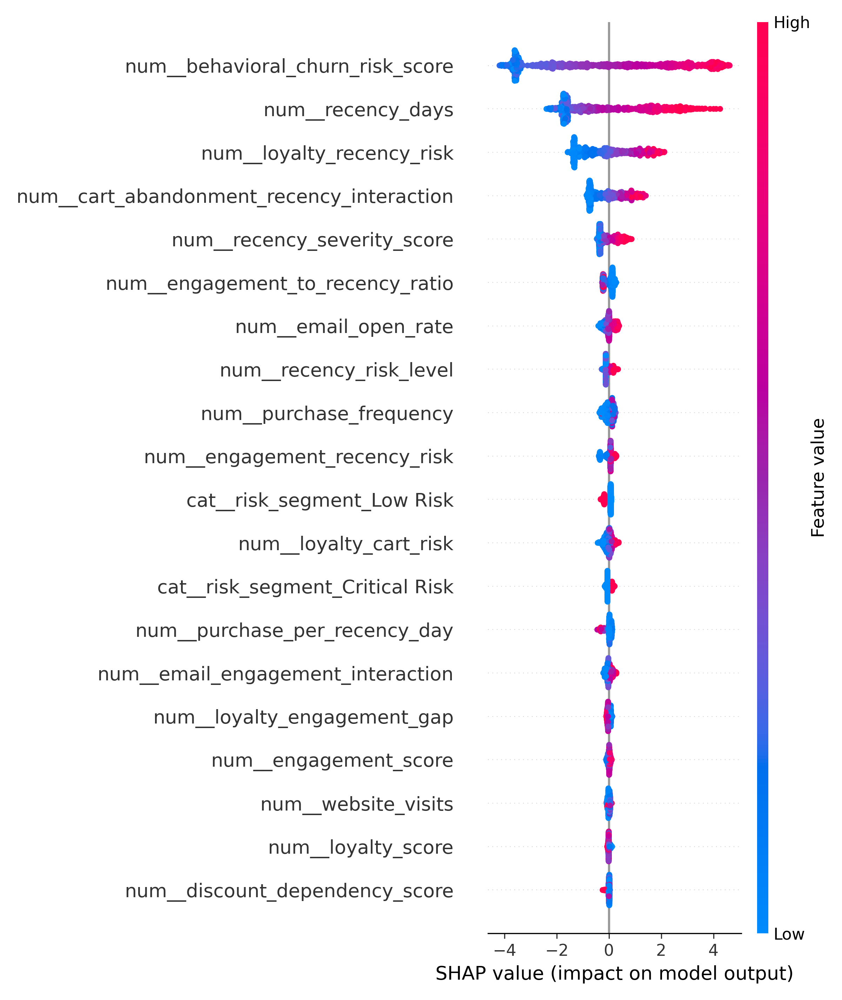 |

**Waterfall Plot — High-Risk Customer Example**

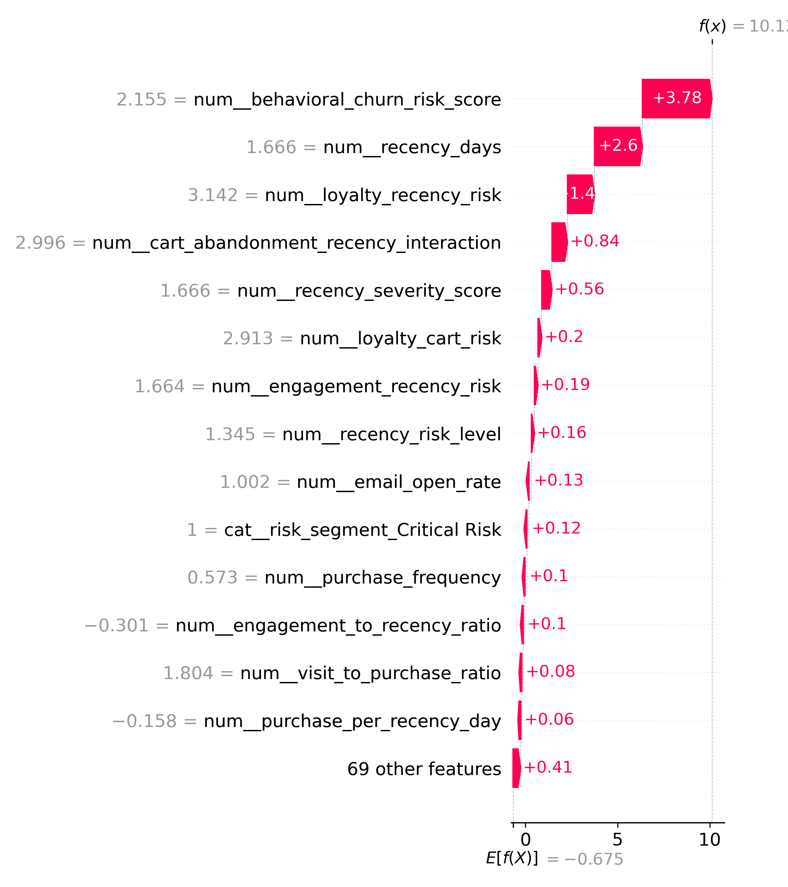

</details>

---

## 🎯 Prediction & Risk Segmentation

Every customer receives a churn probability score mapped to a risk tier with an actionable recommendation.

| Churn Probability | Risk Level | Recommended Action |
|:---:|:---:|---|
| 0.00 – 0.30 | 🟢 **Low Risk** | Maintain engagement |
| 0.31 – 0.60 | 🟡 **Medium Risk** | Send personalized offer |
| 0.61 – 0.80 | 🟠 **High Risk** | Loyalty discount campaign |
| 0.81 – 1.00 | 🔴 **Critical Risk** | Immediate retention call / premium offer |

<details>
<summary>📦 View API Request / Response Example</summary>

**Request — `POST /predict`**
```json
{
  "customer_id": "CUST_001",
  "age_group": "35-44",
  "gender": "Female",
  "region": "West",
  "customer_segment": "Returning",
  "preferred_channel": "Mobile App",
  "purchase_frequency": 3,
  "avg_order_value": 45.5,
  "total_spent": 1250.0,
  "recency_days": 75,
  "website_visits": 20,
  "discount_usage_rate": 0.65,
  "email_open_rate": 0.3,
  "cart_abandonment_rate": 0.72,
  "loyalty_score": 35,
  "engagement_score": 40
}
```

**Response**
```json
{
  "customer_id": "CUST_001",
  "churn_probability": 0.8734,
  "prediction_label": 1,
  "prediction": "Churn",
  "risk_level": "Critical Risk",
  "recommended_action": "Immediate retention call / premium offer"
}
```

</details>

---

## 🖥️ Screenshots

### 📊 Streamlit Business Dashboard

> A full-featured business dashboard with 5 interactive pages — built for analysts and business stakeholders to explore churn patterns, run predictions, and track model health — all without writing a single line of code.

<br/>

**1. Executive Summary** — High-level churn KPIs at a glance: total customers, churn rate, high/critical risk counts, and revenue at risk.

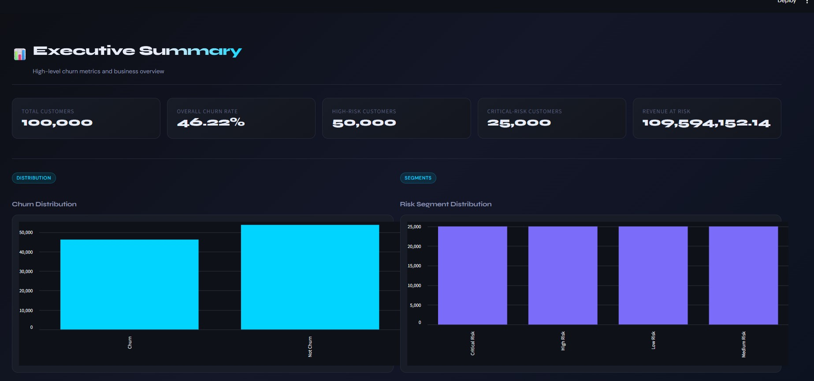

<br/>

**2. Customer Segmentation** — Churn rate breakdown by customer segment (Loyal, New, Returning, VIP) with behavioral analysis.

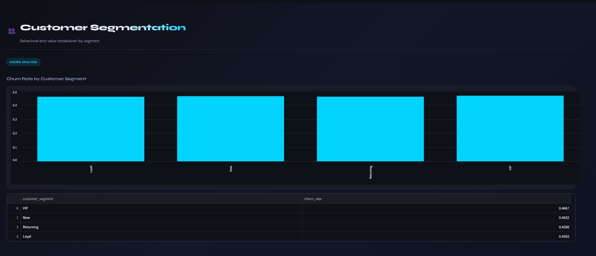

<br/>

**3. Prediction App** — Fill in a customer profile interactively and instantly receive a churn probability score with the recommended retention action.

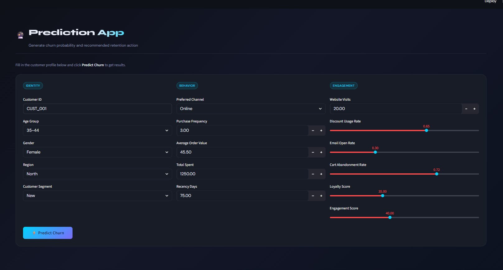

<br/>

**4. Monitoring** — Evidently AI drift report embedded directly in the dashboard. Current status: dataset drift NOT detected (6.97% of columns drifted).

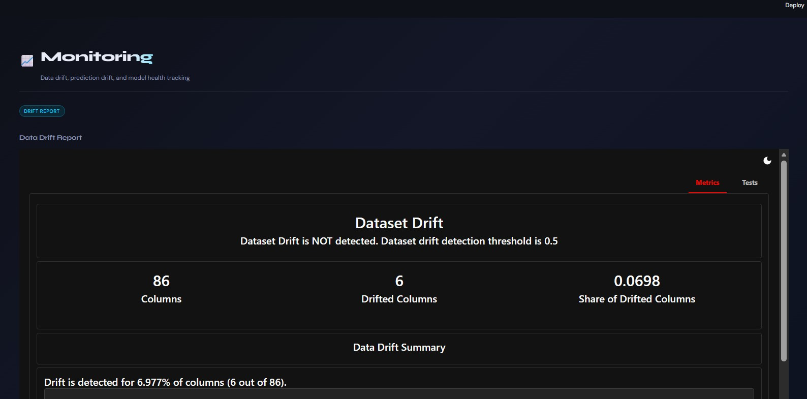

---

### ⚡ FastAPI — REST API with Interactive Docs

> Production-ready REST API with auto-generated Swagger UI. Supports both single-customer and batch predictions, with full request/response schema validation via Pydantic.

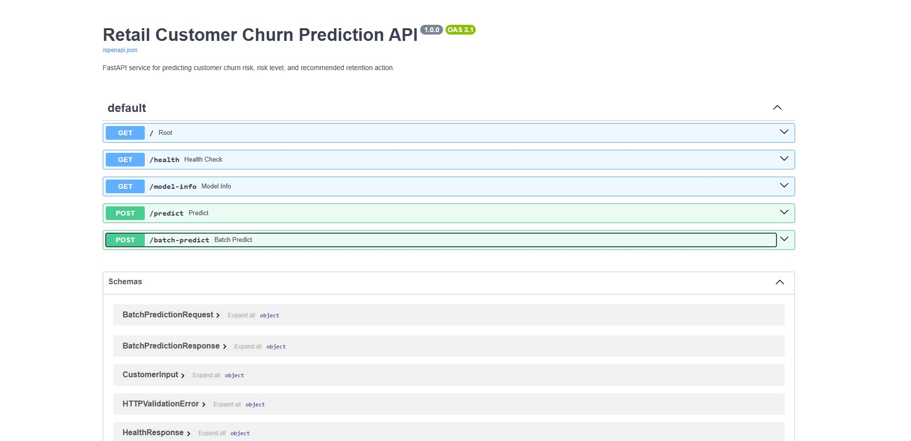

---

### 🧪 MLflow — Experiment Tracking & Model Comparison

> All training runs are automatically logged to MLflow — making it easy to compare models, audit decisions, and promote the best-performing model to production.

<br/>

**Experiment Runs** — 12 runs across 6 model types, all tracked with hyperparameters, metrics, and model artifacts.

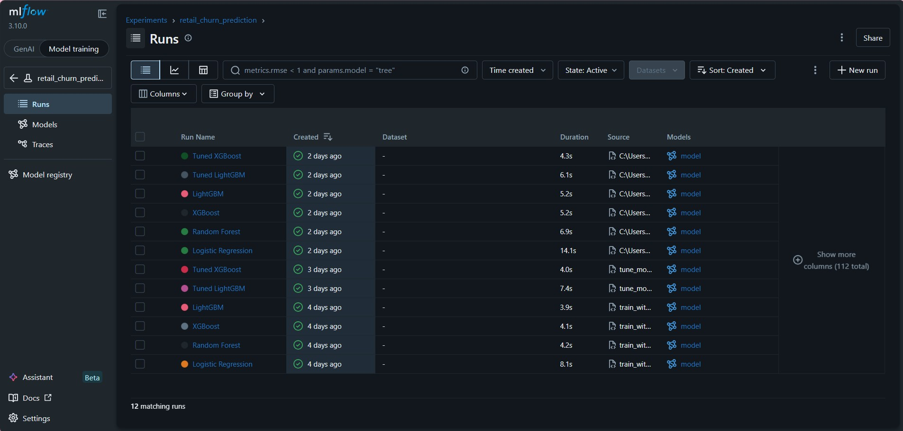

<br/>

**Parallel Coordinates Plot** — Visually compare hyperparameter combinations vs. accuracy across all runs to identify the optimal configuration.

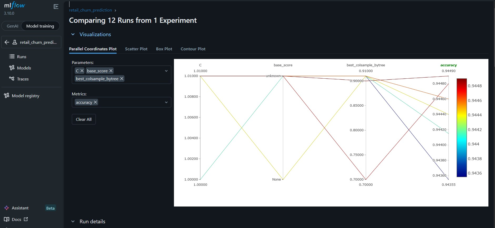

---

## 🛠️ Tech Stack

| Layer | Tools |
|---|---|
| **Language** | Python 3.11 |
| **ML & Modeling** | Scikit-learn, LightGBM, XGBoost |
| **Experiment Tracking** | MLflow |
| **Explainability** | SHAP |
| **Data Validation** | Great Expectations |
| **Monitoring** | Evidently AI |
| **Pipeline** | DVC |
| **API** | FastAPI + Uvicorn |
| **Dashboard** | Streamlit |
| **Testing & Linting** | Pytest, Ruff |
| **Containerization** | Docker, Docker Compose |
| **CI/CD** | GitHub Actions |
| **Data Processing** | Pandas, NumPy |

---

## 🗂️ Project Structure

```text
.
├── api/                        # FastAPI application
│   ├── main.py                 #   Endpoints: /, /health, /predict, /batch-predict
│   └── schemas.py              #   Pydantic request/response schemas
│
├── dashboard/
│   └── app.py                  # Streamlit business dashboard (5 pages)
│
├── images/                     # Screenshots for README
│
├── src/
│   ├── data/
│   │   ├── load_data.py        # Data loading utilities
│   │   └── validate_data.py    # Great Expectations validation
│   ├── features/
│   │   └── build_features.py   # Feature engineering pipeline
│   ├── models/
│   │   ├── train_baseline.py   # Baseline model training
│   │   ├── train_with_mlflow.py# MLflow-tracked training
│   │   ├── tune_model.py       # Hyperparameter tuning
│   │   ├── evaluate_model.py   # Final model evaluation
│   │   └── predict_model.py    # Prediction + risk scoring
│   ├── monitoring/
│   │   └── drift_report.py     # Evidently AI drift detection
│   └── utils/
│       └── config.py           # Centralized configuration
│
├── tests/                      # Pytest test suite (17 tests)
├── notebooks/                  # EDA, experiments, explainability
├── data/                       # Raw, interim, processed, predictions
├── reports/                    # Evaluation, SHAP, monitoring outputs
│
├── Dockerfile
├── docker-compose.yml          # FastAPI + Streamlit + MLflow
├── dvc.yaml                    # Reproducible ML pipeline
├── Makefile                    # Developer shortcuts
├── requirements.txt
└── .github/workflows/          # GitHub Actions CI
```

---

## 🖥️ Live Services

When running via Docker Compose, three services are available simultaneously:

| Service | URL | Description |
|---|---|---|
| **FastAPI** | [localhost:8000/docs](http://localhost:8000/docs) | Interactive API docs (Swagger UI) |
| **Streamlit** | [localhost:8501](http://localhost:8501) | Business dashboard |
| **MLflow** | [localhost:5000](http://localhost:5000) | Experiment tracking UI |

---

## 🚀 Quick Start

### Option A — Docker Compose (Recommended)

Spin up all services with a single command:

```bash
git clone https://github.com/DarlyP/Customer-Churn-Prediction-Platform-for-Retail-Business-Using-Machine-Learning-and-MLOps.git
cd Customer-Churn-Prediction-Platform-for-Retail-Business-Using-Machine-Learning-and-MLOps
docker compose up --build
```

### Option B — Local Setup

```bash
# 1. Clone and enter the project
git clone https://github.com/DarlyP/Customer-Churn-Prediction-Platform-for-Retail-Business-Using-Machine-Learning-and-MLOps.git
cd Customer-Churn-Prediction-Platform-for-Retail-Business-Using-Machine-Learning-and-MLOps

# 2. Create and activate virtual environment
python -m venv .venv
source .venv/bin/activate          # macOS/Linux
# .venv\Scripts\activate           # Windows

# 3. Install dependencies
pip install --upgrade pip
pip install -r requirements.txt

# 4. Reproduce the full ML pipeline
dvc repro

# 5. Run tests
pytest -v

# 6. Start services
uvicorn api.main:app --reload      # API    → localhost:8000/docs
streamlit run dashboard/app.py     # UI     → localhost:8501
mlflow ui                          # MLflow → localhost:5000
```

### Makefile Shortcuts

```bash
make test        # Run Pytest
make api         # Start FastAPI
make dashboard   # Start Streamlit
make monitor     # Generate drift report
make dvc-repro   # Reproduce full pipeline
```

---

## 🔬 MLOps Components

<details>
<summary><b>📦 Experiment Tracking — MLflow</b></summary>

Every training run logs:
- Model name and hyperparameters
- Full evaluation metrics
- Confusion matrix and classification report
- Feature list and model artifact

12 runs across 6 model types are tracked and compared. The parallel coordinates plot makes it easy to see which hyperparameter combinations drive the best accuracy.

```bash
mlflow ui  # → http://localhost:5000
```

</details>

<details>
<summary><b>🔁 Reproducible Pipeline — DVC</b></summary>

The full ML pipeline (validation → features → training → tuning → evaluation → monitoring) is version-controlled with DVC, ensuring anyone can reproduce results exactly.

```bash
dvc repro
```

Pipeline stages: `validate_data` → `build_features` → `train_baseline` → `tune_model` → `evaluate_model` → `drift_report`

</details>

<details>
<summary><b>📡 Drift Monitoring — Evidently AI</b></summary>

Simulates production monitoring by comparing training (reference) data against new monthly customer data. Detects data drift, feature drift, prediction drift, and missing value changes before they silently degrade model performance.

Current monitoring result: **Dataset drift NOT detected** — only 6 out of 86 columns drifted (6.97%), well below the 0.5 threshold.

```bash
python -m src.monitoring.drift_report
# Output: reports/monitoring/data_drift_report.html
```

</details>

<details>
<summary><b>✅ Automated Testing — Pytest</b></summary>

17 tests covering the full system:

| Module | Coverage |
|---|---|
| `test_data_validation.py` | Schema and constraint checks |
| `test_features.py` | Feature engineering outputs |
| `test_prediction.py` | Prediction pipeline and risk scoring |
| `test_api.py` | FastAPI endpoint response schema |

```bash
pytest -v   # → 17 passed
```

</details>

<details>
<summary><b>🤖 CI Pipeline — GitHub Actions</b></summary>

Runs automatically on every push and pull request to `main`:

1. Checkout repository
2. Set up Python environment
3. Install dependencies
4. Lint with Ruff
5. Run Pytest

This ensures the pipeline, prediction logic, and API remain stable after every change.

</details>

---

## 💡 Key Business Recommendations

Based on the model and SHAP analysis, the top signals driving churn are **customer inactivity (recency), cart abandonment rate, low loyalty/engagement scores**, and **declining spending behavior**. Recommended actions:

1. **Critical Risk** — Trigger immediate human outreach (call or premium offer)
2. **High Risk** — Automated loyalty discount campaign
3. **Medium Risk** — Personalized email/push offer
4. **Low Risk** — Standard engagement maintenance
5. Retrain the model when Evidently flags significant drift in key features
6. Prioritize high-value Critical Risk customers first (CLV × churn probability)

---

## 🔮 Roadmap

- [ ] Cloud deployment (AWS / GCP / Azure)
- [ ] DVC remote storage (S3 / Google Drive)
- [ ] Automated retraining pipeline triggered by drift thresholds
- [ ] Model registry promotion workflow (Staging → Production)
- [ ] Real production monitoring from live scoring logs
- [ ] API authentication (JWT / API key)
- [ ] Batch prediction file upload in Streamlit
- [ ] CI Docker build stage

---

**Disclaimer**: 
- This notebook is created solely for learning and exploration purposes. There is no intention to offend or harm any party. All content and analysis presented are based on publicly available data online. I undertake this process to enhance my understanding of data analysis techniques and methodologies and hone my skills in implementing relevant algorithms and models within the context of data science learning. In conducting this analysis, I strive to maintain objectivity and professionalism in interpreting the existing data. Any conclusions or recommendations provided result from personal analysis and are not intended as professional advice in any specific capacity. I hope the information obtained from this notebook can be useful to anyone reading it to learn and develop data analysis skills.

⭐ **If this project was helpful, consider giving it a star!** ⭐

---

</div>
